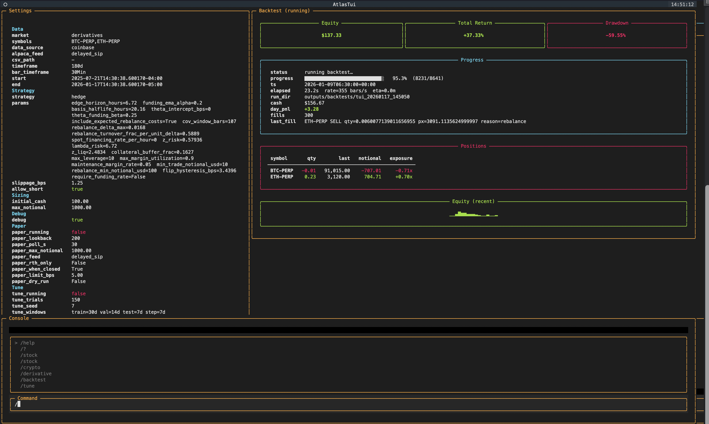
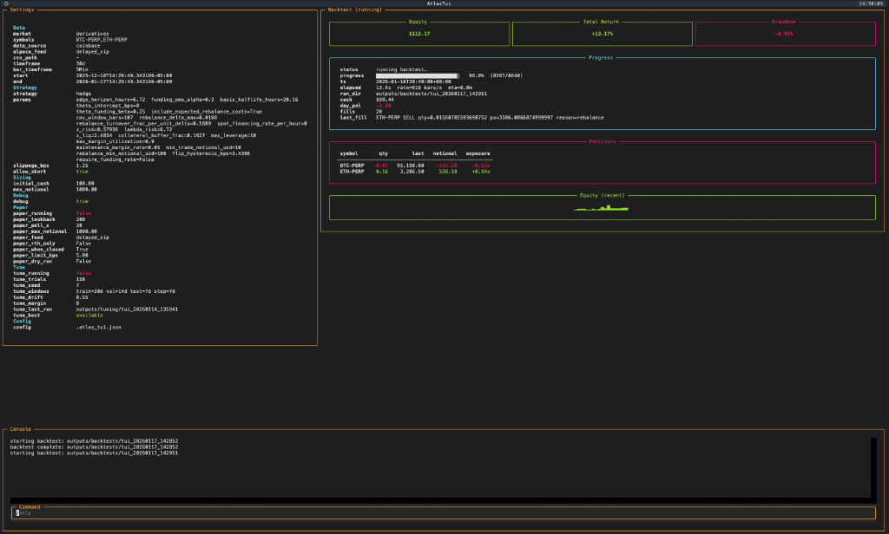
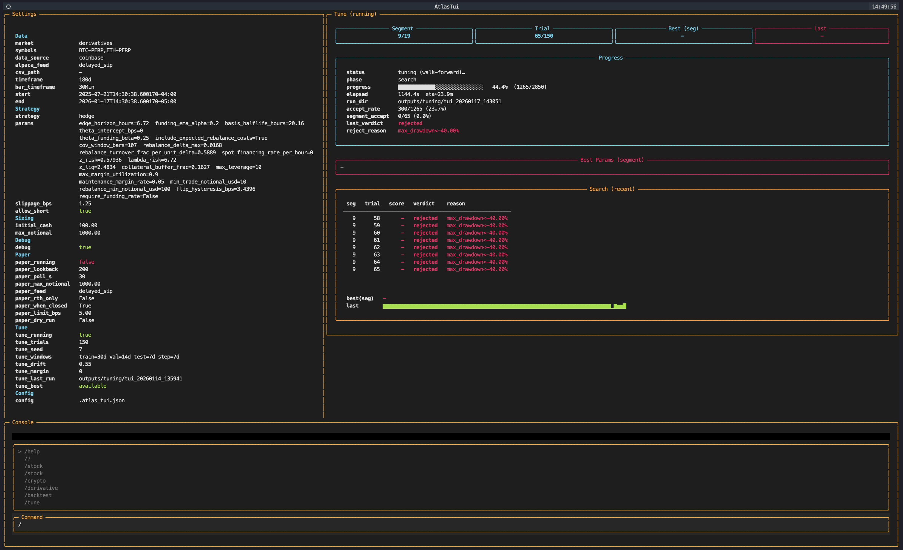

<p align="center">
  <h1 align="center">🌐 Atlas</h1>
  <p align="center">
    <strong>Quantitative Trading Research Platform</strong>
  </p>
  <p align="center">
    Intraday algorithmic trading scaffold for US equities and crypto derivatives with paper trading, walk-forward optimization, and a full-featured terminal UI <br><i>(AI-Generated README/Documentation)</i>
  </p>
</p>

<p align="center">
  
</p>

<p align="center">
  <a href="#features">Features</a> •
  <a href="#quickstart">Quickstart</a> •
  <a href="#terminal-ui">Terminal UI</a> •
  <a href="#trading-algorithms">Algorithms</a> •
  <a href="#architecture">Architecture</a> •
  <a href="#data-sources">Data Sources</a>
</p>

---

## What is Atlas?

Atlas is a **quantitative trading platform** designed for developing, backtesting, and paper-trading intraday strategies across multiple asset classes, which I made because I was bored :D. Built with a safety-first philosophy, Atlas defaults to paper trading mode and provides comprehensive risk controls including daily loss limits, drawdown kill-switches, and liquidation buffers. 

Mainly used for me to play around with and test different quant-algorithms I design when bored.

The platform supports:
- **US Equities** (SPY, QQQ, individual stocks) via Alpaca
- **Crypto Spot** markets via Coinbase
- **Perpetual Futures** (BTC-PERP, ETH-PERP) with full derivatives modeling including funding rates, maintenance margin, and liquidation mechanics

Atlas includes several **original research algorithms** implementing novel approaches to regime detection, cost-aware admission, and risk-adjusted position sizing—designed for high Sharpe ratio consistency rather than raw returns.

> ⚠️ **Disclaimer**: This is research/educational software and is not financial advice. Paper trading is enabled by default.

---

## Features

### 🖥️ Interactive Terminal UI

Full-screen Textual-based dashboard with real-time metrics, position tracking, and slash-command interface.

<details>
<summary><strong>View Screenshots</strong></summary>

**Live Backtest with Hedge Strategy**


**Backtest Complete (+23% Return)**


**Walk-Forward Parameter Optimization**


</details>

### 📊 Multi-Asset Backtesting

- Minute-level bars (1m, 5m, 30m)
- Equity engine with simple fill model
- **Derivatives engine** with taker fees, funding rate accrual, margin calculations, and liquidation simulation

### 🔧 Walk-Forward Optimization

Rolling train/validate/test window hyperparameter tuning with stability-biased parameter selection across market regimes.

### 📈 Paper Trading

Safe-by-default Alpaca integration with automatic order journaling and equity curve tracking.

### 🧠 Research-Grade Strategy Framework

Pluggable strategy architecture with standardized interfaces for signal generation, position sizing, and risk management.

---

## Quickstart

### 1. Create and Activate Environment

```bash
cd atlas
python3 -m venv .venv
source .venv/bin/activate
pip install -U pip
pip install -e .
```

### 2. Run a Local Backtest (No API Keys Required)

Uses bundled sample data in `data/sample/`:

```bash
atlas backtest --symbol SPY --data-source sample
```

**Expected output:**
```
Backtest Summary
================
Window:        2024-01-02 09:30:00 → 2024-01-02 16:00:00
Bars:          390
Strategy:      ma_crossover
Total Return:  +1.23%
Sharpe:        0.85
Max Drawdown:  -0.45%
```

Outputs saved to `outputs/backtests/{run_id}/`:
- `trades.csv` / `trades.json` — individual trade records
- `equity_curve.csv` — per-bar equity snapshots
- `metrics.json` — summary statistics
- `run.log` — execution log

### 3. Launch the Terminal UI

```bash
atlas tui
```

The TUI provides an interactive dashboard where you can configure and run backtests, tune parameters, and monitor paper trading—all via slash commands.

### 4. Set Up Paper Trading (Optional)

1. Create an [Alpaca](https://alpaca.markets/) account and enable paper trading
2. Generate paper API keys in the Alpaca dashboard
3. Copy `.env.example` to `.env` and configure:

```bash
ALPACA_API_KEY=your_paper_key
ALPACA_SECRET_KEY=your_paper_secret
ALPACA_PAPER=true
```

Run the paper loop:
```bash
atlas paper --symbols SPY --strategy ma_crossover --fast-window 10 --slow-window 30
```

---

## Terminal UI

The TUI is a full-featured terminal dashboard built with [Textual](https://github.com/Textualize/textual). It provides:

| Panel | Description |
|-------|-------------|
| **Settings** | Current configuration (market, symbols, strategy, parameters) |
| **Progress** | Live backtest/tune progress with ETA |
| **Positions** | Current symbol, quantity, notional, exposure |
| **Equity (recent)** | Sparkline equity curve |
| **Console** | Log output and status messages |
| **Command** | Slash-command input with autocomplete |

### Slash Commands Reference

| Command | Description | Example |
|---------|-------------|---------|
| `/help` | Show all available commands | `/help` |
| `/backtest` | Run a backtest with current settings | `/backtest` |
| `/tune` | Run walk-forward parameter optimization | `/tune` |
| `/paper start` | Start paper trading loop | `/paper start` |
| `/paper stop` | Stop paper trading | `/paper stop` |
| `/market` | Set market mode | `/market derivatives` |
| `/symbol` | Set trading symbol(s) | `/symbol BTC-PERP,ETH-PERP` |
| `/data` | Set data source | `/data coinbase` |
| `/algorithm` | Select trading strategy | `/algorithm hedge` |
| `/timeframe` | Set backtest window | `/timeframe 30d` |
| `/bar` | Set bar timeframe | `/bar 5Min` |
| `/cash` | Set initial capital | `/cash 10000` |
| `/param` | Set strategy parameter | `/param edge_horizon_hours 6` |
| `/save` | Save current configuration | `/save` |
| `/load` | Load saved configuration | `/load` |

### Timeframe Syntax

Supports relative and absolute time specifications:
- Relative: `6h`, `1d`, `7d`, `30d`, `1y`
- Absolute: `2024-01-01T09:30:00-05:00`
- Clear: `/timeframe clear` (use all available data)

---

## Trading Algorithms

Atlas includes both **baseline strategies** for validation and **original research algorithms** implementing novel techniques for regime detection, cost-aware entry, and dynamic risk management.

### Baseline Strategies

Simple implementations for sanity-checking the backtest infrastructure:

| Strategy | Description |
|----------|-------------|
| `ma_crossover` | Classic moving average crossover (fast/slow EMA) |
| `ema_crossover` | Exponential moving average variant |
| `spy_open_close` | Buy at open, sell at close |
| `no_trade` | Benchmark strategy that never trades |

---

## Original Research Algorithms

The following strategies represent **original research contributions** implementing novel approaches to quantitative trading. Each algorithm addresses specific challenges in real-world trading: transaction cost friction, regime uncertainty, and tail risk management.

### Hedge (BasisCarry)

**Market-Neutral Basis & Carry Strategy**

A delta-neutral strategy that exploits the basis spread and funding rate differential between spot and perpetual futures markets.

**Core Concept:**
- Long spot asset + Short perpetual (cash-and-carry)
- Captures positive funding when perps trade at premium
- Optional reverse mode (short spot + long perp) for backwardation regimes

**Novel Research Elements:**
- **Funding EMA smoothing** to filter noise in hourly funding rate snapshots
- **Basis mean-reversion model** with configurable half-life for expected basis convergence
- **Basis momentum filtering** to avoid entry during adverse basis expansion
- **Risk sizing via collateral buffer** ensuring positions survive z-sigma daily moves

**Key Parameters:**
| Parameter | Default | Description |
|-----------|---------|-------------|
| `funding_ema_alpha` | 0.20 | Funding rate EMA smoothing factor |
| `funding_entry_bps_per_day` | 10.0 | Min funding to enter (bps/day) |
| `edge_horizon_hours` | 8.0 | Expected holding period for edge calculation |
| `basis_halflife_hours` | 24.0 | Mean-reversion half-life assumption |
| `z_sigma_daily` | 3.0 | Collateral buffer for daily moves |
| `max_leverage` | 3.0 | Maximum gross leverage |

**Use Case:** Market-neutral alpha generation in trending funding environments.

---

### PerpFlare

**ER-Gated Donchian Breakout with Liquidation Buffers**

A momentum-breakout strategy designed for crypto perpetuals that combines multiple regime filters with strict admission control.

**Core Concept:**
- Donchian channel breakouts (highest high / lowest low over lookback)
- Trend confirmation via EMA crossover direction
- Efficiency Ratio (ER) gate to filter chop regimes

**Novel Research Elements:**
- **Adaptive cost-aware admission**: `required_edge_bps = floor + k_cost × friction` where friction includes estimated slippage, fees, and funding penalty
- **Edge scoring**: Combines breakout strength (bps above/below channel) with trend momentum
- **Liquidation buffer enforcement**: Position sizing constrained so stop-loss triggers before liquidation price
- **Funding penalty in admission**: Funding rate impacts entry threshold dynamically

**Key Parameters:**
| Parameter | Default | Description |
|-----------|---------|-------------|
| `er_min` | 0.35 | Minimum Efficiency Ratio to trade |
| `breakout_window` | 20 | Donchian channel lookback |
| `edge_floor_bps` | 5.0 | Minimum edge required |
| `k_cost` | 1.5 | Cost multiplier in admission |
| `stop_atr_mult` | 2.0 | Stop distance in ATR |
| `min_liq_buffer_atr` | 3.0 | Min distance to liquidation in ATR |

**Use Case:** Trend-following entries on BTC/ETH perpetuals with strict risk controls.

---

### PerpHawk

**Volatility-Targeted Regime-Filtered Trend Strategy**

A lower-turnover trend-following approach that emphasizes survival (daily loss limits, kill-switches) and portfolio-level risk management.

**Core Concept:**
- EMA trend detection with z-score trend strength
- Donchian breakout confirmation
- Multi-symbol scoring with position limits

**Novel Research Elements:**
- **Portfolio-level sizing**: Risk budget allocated across symbols proportional to signal strength
- **Trailing stop with ATR anchoring**: Trail updates only on favorable moves
- **Flip confirmation**: Requires multiple bars of opposite signal before exiting/flipping
- **Daily loss limit + kill-switch**: Hard caps on session and cumulative drawdown

**Key Parameters:**
| Parameter | Default | Description |
|-----------|---------|-------------|
| `risk_budget` | 0.01 | Fraction of equity risked per position |
| `max_positions` | 2 | Maximum concurrent positions |
| `daily_loss_limit` | 0.02 | Session loss limit (2%) |
| `kill_switch` | 0.10 | Cumulative drawdown kill (10%) |
| `flip_confirm_bars` | 3 | Bars required to confirm direction change |

**Use Case:** Multi-asset perpetual portfolio with robust drawdown controls.

---

### PerpScalp

**High-Leverage BTC Scalping with Strict Risk Controls**

An aggressive short-term strategy designed for 1-5 minute bars with tight risk management suitable for research/paper trading.

**Core Concept:**
- Breakout + trend alignment entries
- Quick take-profit/stop-loss exits
- Maximum hold time constraint

**Novel Research Elements:**
- **Dual sizing modes**: Risk-based (targets stop-loss risk) vs leverage-based (targets exposure)
- **Liquidation-aware sizing**: Caps position size so stop triggers before liquidation
- **Time stop**: Exits after `max_hold_bars` regardless of P&L
- **Extended cooldown after losses**: 2× cooldown period after losing trades

**Key Parameters:**
| Parameter | Default | Description |
|-----------|---------|-------------|
| `risk_per_trade` | 0.005 | Risk per trade (0.5%) |
| `stop_atr_mult` | 1.2 | Tight stop distance |
| `take_profit_atr_mult` | 1.5 | Take profit distance |
| `max_hold_bars` | 12 | Maximum holding period |
| `max_leverage` | 5.0 | Leverage cap |

**Use Case:** High-frequency research on BTC perpetuals.

---

### OrbTrend

**Opening Range Breakout + VWAP Trend Strategy**

An intraday equity strategy based on Opening Range Breakout (ORB) methodology with VWAP confirmation and trend quality filtering.

**Core Concept:**
- Compute opening range (first N minutes) high/low
- Enter on confirmed breakout (closes above/below range with buffer)
- VWAP alignment for trend confirmation

**Novel Research Elements:**
- **ORB + VWAP dual confirmation**: Reduces false breakouts by requiring price on correct side of VWAP
- **Efficiency Ratio gate**: Abstains entirely in choppy/mean-reverting regimes
- **Cost-aware edge calculation**: `net_edge = edge - k_cost × cost_roundtrip`
- **Hysteresis exits**: Requires meaningful retracement into range before exiting

**Key Parameters:**
| Parameter | Default | Description |
|-----------|---------|-------------|
| `orb_minutes` | 30 | Opening range window |
| `orb_breakout_bps` | 4.0 | Breakout buffer (bps) |
| `confirm_bars` | 2 | Consecutive bars for confirmation |
| `er_min` | 0.35 | ER threshold |
| `k_cost` | 2.0 | Cost multiplier |
| `daily_loss_limit` | 0.01 | 1% daily loss limit |

**Use Case:** Intraday momentum on SPY/QQQ with cost-aware filtering.

---

### NEC-PDT

**PDT-Compliant Momentum Strategy with Budget Management**

An intraday momentum strategy specifically designed for accounts under the Pattern Day Trader (PDT) rule, implementing explicit day-trade budget tracking.

**Core Concept:**
- Dual-symbol momentum scoring (SPY + QQQ confirmation)
- Rolling 5-day day-trade budget tracking
- One-and-done daily entries with ATR trailing stops

**Novel Research Elements:**
- **EMA momentum scoring**: `score = mean_return / volatility` (modified Sharpe)
- **Confirmation requirement**: Both SPY and QQQ must agree on direction
- **Budget-adjusted threshold**: Entry threshold increases as day-trade budget depletes
- **Anti-flip logic**: Requires multiple bars of signal deterioration before exiting

**Key Parameters:**
| Parameter | Default | Description |
|-----------|---------|-------------|
| `M` | 6 | Fast EMA window |
| `V` | 12 | Volatility EMA window |
| `max_day_trades_per_rolling_5_days` | 3 | PDT budget |
| `base_thr_bps` | 10.0 | Base entry threshold |
| `budget_step_bps` | 4.0 | Threshold increase per trade used |
| `flip_confirm_bars` | 3 | Bars to confirm exit |

**Use Case:** Intraday trading under PDT constraints with explicit budget management.

---

## Architecture

Atlas follows a modular architecture separating data, strategy, execution, and reporting concerns:

```
┌─────────────────────────────────────────────────────────────┐
│                         CLI / TUI                           │
├─────────────────────────────────────────────────────────────┤
│                                                             │
│  ┌─────────────┐   ┌─────────────┐   ┌─────────────────┐   │
│  │ Data Layer │   │  Strategies │   │ Execution Layer │   │
│  │             │   │             │   │                 │   │
│  │ • Alpaca    │   │ • Registry  │   │ • Backtest Eng  │   │
│  │ • Coinbase  │   │ • Base      │   │ • Derivatives   │   │
│  │ • CSV       │   │ • Custom    │   │ • Paper Loop    │   │
│  │ • Sample    │   │             │   │ • Broker        │   │
│  └─────────────┘   └─────────────┘   └─────────────────┘   │
│         │                 │                   │             │
│         └────────────────┼───────────────────┘             │
│                          ▼                                 │
│  ┌──────────────────────────────────────────────────────┐  │
│  │                     Outputs                          │  │
│  │  outputs/backtests/{run_id}/  outputs/paper/{run_id}/ │  │
│  │  • trades.csv/json  • equity_curve.csv  • metrics.json│  │
│  └──────────────────────────────────────────────────────┘  │
│                                                             │
└─────────────────────────────────────────────────────────────┘
```

### Key Modules

| Module | Path | Description |
|--------|------|-------------|
| CLI | `src/atlas/cli.py` | Click-based command line interface |
| TUI | `src/atlas/tui/app.py` | Textual-based terminal dashboard |
| Strategies | `src/atlas/strategies/` | Strategy registry and implementations |
| Backtest Engine | `src/atlas/backtest/engine.py` | Equity backtest execution |
| Derivatives Engine | `src/atlas/backtest/derivatives_engine.py` | Perpetuals with funding/margin |
| Paper Loop | `src/atlas/paper/runner.py` | Live paper trading |
| Data | `src/atlas/data/` | Data loaders (Alpaca, Coinbase, CSV) |

### Strategy Interface

All strategies implement the `Strategy` base class:

```python
@dataclass
class Strategy:
    def warmup_bars(self) -> int:
        """Number of bars needed before generating signals."""
        ...

    def target_exposures(
        self,
        bars_by_symbol: dict[str, pd.DataFrame],
        state: StrategyState,
    ) -> StrategyDecision:
        """Return target exposure per symbol."""
        ...
```

The `StrategyState` provides:
- Current equity and positions
- Holding duration per symbol
- Day return for risk controls
- `allow_short` flag
- `extra` dict with engine-specific context (funding rates, margin requirements)

---

## Data Sources

| Source | Command | Description |
|--------|---------|-------------|
| `sample` | `--data-source sample` | Bundled SPY minute bars (no setup required) |
| `csv` | `--data-source csv --csv-path /path/to/file.csv` | User-provided CSV file |
| `alpaca` | `--data-source alpaca` | Alpaca Market Data (requires API keys) |
| `coinbase` | `--data-source coinbase` | Coinbase public data (spot + futures) |

### Derivatives Mode

For perpetual futures backtesting, use `--market derivatives`:

```bash
atlas backtest \
  --market derivatives \
  --symbol BTC-PERP \
  --data-source coinbase \
  --bar-timeframe 5Min \
  --start 2024-01-01T00:00:00Z \
  --end 2024-01-31T00:00:00Z
```

The derivatives engine models:
- Taker fees (configurable, default 3 bps)
- Funding rate accrual (8-hour intervals)
- Maintenance margin requirements
- Liquidation events

---

## Walk-Forward Optimization

Atlas includes a rolling walk-forward optimizer for robust hyperparameter selection:

```bash
atlas tune \
  --market derivatives \
  --symbol BTC-PERP,ETH-PERP \
  --data-source coinbase \
  --bar-timeframe 5Min \
  --timeframe 60d \
  --trials-per-segment 60 \
  --train 30d \
  --validate 7d \
  --test 7d \
  --step 7d
```

The optimizer:
1. Divides data into rolling windows (train/validate/test)
2. Runs Optuna trials on train period
3. Validates on held-out data
4. Advances window and repeats

**Output files:**
- `best_params.json` — Raw best parameters per segment
- `best_params_stable.json` — Stability-biased median parameters
- `selections.json` — Parameter selection per segment
- `stability.json` — Cross-segment parameter stability analysis

---

## Configuration

### Environment Variables

| Variable | Default | Description |
|----------|---------|-------------|
| `ALPACA_API_KEY` | — | Alpaca API key |
| `ALPACA_SECRET_KEY` | — | Alpaca secret key |
| `ALPACA_PAPER` | `true` | Use paper trading endpoints |
| `ATLAS_ALLOW_LIVE` | `false` | Must be `true` to disable paper mode |
| `ATLAS_LOG_LEVEL` | `INFO` | Logging verbosity |
| `ATLAS_BACKTEST_MAX_POSITION_NOTIONAL_USD` | — | Max position size in backtests |
| `ATLAS_PAPER_MAX_POSITION_NOTIONAL_USD` | — | Max position size in paper trading |

### Safety by Default

Atlas enforces multiple safety mechanisms:

1. **Paper mode by default**: `ALPACA_PAPER=true`
2. **Live trading blocked**: Requires both `ALPACA_PAPER=false` AND `ATLAS_ALLOW_LIVE=true`
3. **Strategy-level controls**: Daily loss limits, drawdown kill-switches
4. **Position limits**: Configurable max notional per symbol

---

## CLI Reference

```bash
atlas --help              # Show all commands
atlas backtest --help     # Backtest options
atlas tune --help         # Walk-forward tune options
atlas paper --help        # Paper trading options
atlas download-bars --help # Download historical data
atlas tui                 # Launch terminal UI
```

### Backtest Examples

```bash
# Simple equity backtest
atlas backtest --symbol SPY --data-source sample

# Multi-symbol derivatives backtest
atlas backtest \
  --market derivatives \
  --symbol BTC-PERP,ETH-PERP \
  --data-source coinbase \
  --algorithm hedge \
  --bar-timeframe 5Min \
  --initial-cash 10000

# With custom strategy parameters
atlas backtest \
  --symbol SPY,QQQ \
  --algorithm orb_trend \
  --strategy-params '{"orb_minutes": 15, "er_min": 0.4}'
```

---

## Extending Atlas

### Adding a New Strategy

1. Create a new file in `src/atlas/strategies/`:

```python
# src/atlas/strategies/my_strategy.py
from dataclasses import dataclass
from atlas.strategies.base import Strategy, StrategyDecision, StrategyState

@dataclass
class MyStrategy(Strategy):
    name: str = "my_strategy"
    lookback: int = 20
    threshold: float = 0.5

    def warmup_bars(self) -> int:
        return self.lookback + 5

    def target_exposures(
        self,
        bars_by_symbol: dict[str, pd.DataFrame],
        state: StrategyState,
    ) -> StrategyDecision:
        # Your logic here
        return StrategyDecision(
            target_exposures={"SPY": 1.0},
            reason="enter",
            debug={"signal": 0.75}
        )
```

2. Register in `src/atlas/strategies/registry.py`:

```python
from atlas.strategies.my_strategy import MyStrategy

STRATEGY_REGISTRY["my_strategy"] = MyStrategy
```

3. Use via CLI: `atlas backtest --algorithm my_strategy`

---

## Project Structure

```
atlas/
├── src/atlas/
│   ├── backtest/          # Backtest engines (equity, derivatives)
│   ├── broker/            # Order execution
│   ├── coinbase/          # Coinbase data integration
│   ├── data/              # Data loaders
│   ├── ml/                # Machine learning utilities
│   ├── paper/             # Paper trading loop
│   ├── strategies/        # Strategy implementations
│   │   ├── base.py        # Strategy interface
│   │   ├── registry.py    # Strategy registry
│   │   ├── perp_flare.py  # PerpFlare
│   │   ├── perp_hawk.py   # PerpHawk
│   │   ├── perp_scalp.py  # PerpScalp
│   │   ├── orb_trend.py   # OrbTrend
│   │   ├── nec_pdt.py     # NEC-PDT
│   │   ├── basis_carry.py # Hedge (BasisCarry)
│   │   └── ...
│   ├── tui/               # Terminal UI
│   └── cli.py             # CLI entry point
├── data/                  # Data directory
│   ├── sample/            # Bundled sample data
│   ├── alpaca/            # Downloaded Alpaca data
│   └── coinbase/          # Downloaded Coinbase data
├── outputs/               # Backtest/paper outputs
├── docs/                  # Documentation
└── pyproject.toml         # Package configuration
```

---

## License

This project is for research and educational purposes. See `LICENSE` for details.

---

<p align="center">
  Built for quantitative research 📈
</p>
